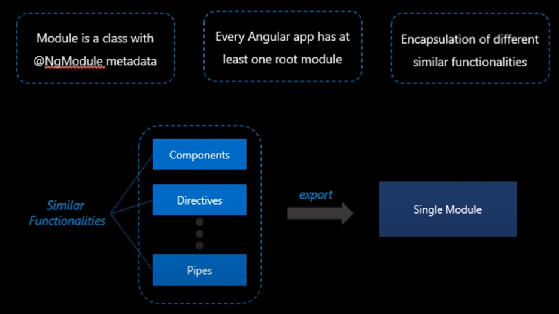
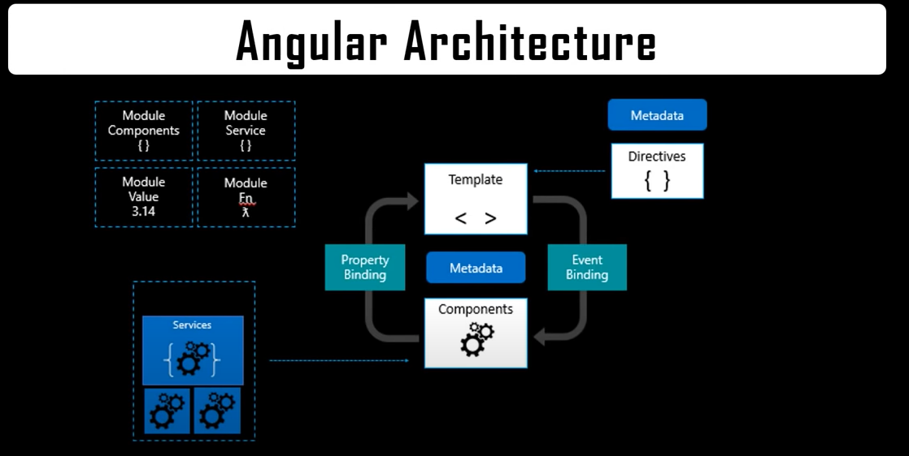
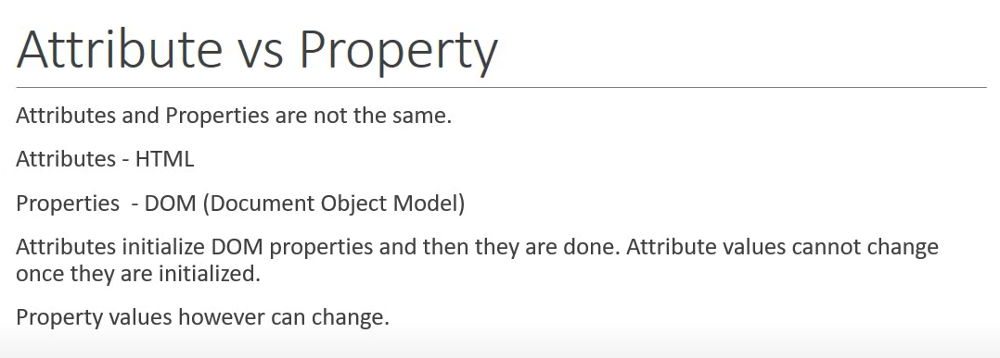
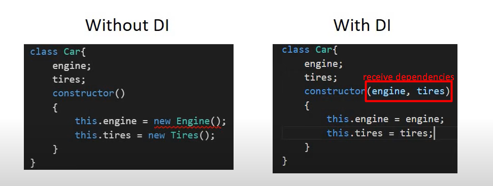

# RecipeApp

This project was generated with [Angular CLI](https://github.com/angular/angular-cli) version 12.2.4.

## Development server

Run `ng serve` for a dev server. Navigate to `http://localhost:4200/`. The app will automatically reload if you change any of the source files.

## Code scaffolding

Run `ng generate component component-name` to generate a new component. You can also use `ng generate directive|pipe|service|class|guard|interface|enum|module`.

## Build

Run `ng build` to build the project. The build artifacts will be stored in the `dist/` directory.

## Running unit tests

Run `ng test` to execute the unit tests via [Karma](https://karma-runner.github.io).

## Running end-to-end tests

Run `ng e2e` to execute the end-to-end tests via a platform of your choice. To use this command, you need to first add a package that implements end-to-end testing capabilities.

## Further help

To get more help on the Angular CLI use `ng help` or go check out the [Angular CLI Overview and Command Reference](https://angular.io/cli) page.

---

# Angular Learnings

## Introduction

- Easy to use
- Provides **MVC** Architecture
- Compatible with both desktops and mobile applications
- Provides filters to filter out different data types
- Two way data binding
- Availability of different modules
- Very good testing abilities
- Flexible & Extensible
- Requires TypeScript 3.4
- Provides opt-in-Ivy preview (Ivy - next gen compilation & rendering preview)
- Can produce legacy and modern JS bundles
- Provides backwards compatibility of router
- Opt-in usage sharing
- Has dependency updates
- Provides Web Worker bundling
  

## Architecture



## Installation

`npm i -g @angular/cli`

## Check the version

`ng version` or `npx ng version`

## Create a new angular project

`ng new project-name` or
`npx ng new project-name`

`ng new project-name --no-strict` or
`npx ng new project-name --no-strict`

## Create a component in CLI

`ng generate compnent component_name` or  
`ng g c component_name`or
`ng g c component_name --spec false` or
`ng g c component_name --skip-tests=true`

## Attribute vs Property



## Databinding

```
Typescript      ------> Template
(BusinessLogic) <------ (HTML)
```

**Output Data**

1. String Interpolation `{{data}}`
2. Property Binding `[property] ="data"`

**React to (User) Events**

1. Event Binding `(event) = "expression"`

**Combination of both**
Two way binding `[(ngModel)]="data"`

#### Property Binding vs String Interpolation

When you need to concatenate strings, you must use interpolation instead of property binding. Property Binding is used when you have to set an element property to a non-string data value.

## Directive

1. **Structural Directive**

Structural directives are able to change the behavior of DOM by adding and removing DOM elements. The directive NgFor, NgSwitch, and NgIf is the best example of structural directives.

```html
<p *ngIf="serverCreated ; else noServer">Server name is {{ serverName }}</p>
<ng-template #noServer> No server was created</ng-template>
```

2. **Attribute Directive**

Attribute directives are able to change the behavior of DOM. The directive NgStyle is an example of Attribute directives which are used to change styles elements at the same time.

```html
<p
  [ngStyle]="{ backgroundColor: getColor() }"
  [ngClass]="{ online: serverStatus === 'Online' }"
>
  Server with id {{ serverId }} is on {{ getServerStatus() }}.
</p>

<app-server *ngFor="let server of servers"></app-server>
```

## Property & Event Binding

1. HTML elements - Native properties & Events
2. Directives - Custom properties & Events
3. Components - Custom properties & Events

```html
@input // to send data from Parent to Child @Output // to send data from Child
to Parent
```

```js
@Input('Alias') propertyName = value; //to get the property accessible outside of component
@Output('Alias') eventName = new EventEmitter<{type}>(); //to make event listen to changes outside of component
```

## View Encapsulation

Avoid mixing components that use different view encapsulation. Where it is necessary, you should be aware of how the component styles will interact.

1. `ViewEncapsulation.Emulated` - making them available throughout the application, but are "scoped" so they only affect elements within the component's template.

2. `ViewEncapsulation.None` - making them available throughout the application, and are not "scoped" so they can affect any element in the application. Will affect matching elements within the shadow DOM.

3. `ViewEncapsulation.ShadowDom` - ensuring that they only affect elements within the component's template.

All the styles for `ViewEncapsulation.Emulated` and `ViewEncapsulation.None` components are also added to the shadow DOM host of each `ViewEncapsulation.ShadowDom` component.

## Local Reference to any HTML Template

```html
<input #phone placeholder="phone number" />

<!-- lots of other elements -->

<!-- phone refers to the input element; pass its `value` to an event handler -->
<button (click)="callPhone(phone.value)">Call</button>`
```

## How Angular assigns values to template variables

Angular assigns a template variable a value **based on where you declare the variable**:

1. If you declare the variable on a component, the variable refers to the component instance.
2. If you declare the variable on a standard HTML tag, the variable refers to the element.
3. If you declare the variable on an <ng-template> element, the variable refers to a TemplateRef instance, which represents the template. For more information on <ng-template>, see How Angular uses the asterisk, \*, syntax in Structural directives.
4. If the variable specifies a name on the right-hand side, such as #var="ngModel", the variable refers to the directive or component on the element with a matching exportAs name.

## Pipes

```html
<!-- String -->
<h2>name</h2>
<h2>{{name | lowercase}}</h2>
<h2>{{name | uppercase}}</h2>
<h2>{{name | titlecase}}</h2>
<h2>{{name | slice:3:5}}</h2>
<h2>{{objectname | json}}</h2>
<!-- Number -->
<h2>{{5.678 | number:'1.2-5'}}</h2>
<h2>{{5.678 | number:'3.4-5'}}</h2>
<h2>{{5.678 | number:'3.1-2'}}</h2>
<h2>{{0.25 | percent}}</h2>
<h2>{{0.25 | currency}}</h2>
<h2>{{0.25 | currency : 'GBP'}}</h2>
<h2>{{0.25 | currency : 'GBP' : 'code'}}</h2>
<!-- Date -->
<h2>{{date}}</h2>
<h2>{{date | date:'short'}}</h2>
<h2>{{date | date:'shortDate'}}</h2>
<h2>{{date | date:'shortTime'}}</h2>
<h2>{{date | date:'mediumTime'}}</h2>
<h2>{{date | date:'mediumDate'}}</h2>
<h2>{{date | date:'LongTime'}}</h2>
<h2>{{date | date:'LongDate'}}</h2>
```

## Services

A class with specific purpose

1. Share data
2. Implement application logic
3. External Interaction

Naming Convention - \*.service.ts
`npx ng g s servicename`
Eg:- `npx ng g s employee` This will create **employee.service.ts** file

## Dependency Injection

1. DI is design pattern in which a class receives its dependencies from external sources rather than creating them itself
   
2. DI as a framework
   - Define the service class (Creating the class)
   - Register with Injector (Refering the class in Providers in high level (AppModule) to make it accessible application wide)
   - Declare as dependency in required components/services (refer it in constructor to get the instance of the service, assign the dependency in **ngOnInit** lifecycle, use @Injectable while refering a service inside of another service)

## Hierarchical Injector

1. AppModule - Same instance of service available Application-wide
2. AppComponent - Same instance of service available for all components (but not for other services)
3. Any Other Component - Same instance of service available for the component and all its child components
